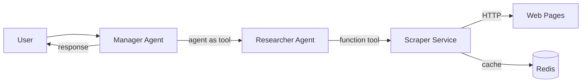

# Architecture

```mermaid
flowchart LR
    user[User] --> manager[Manager Agent]
    manager -->|agent as tool| researcher[Researcher Agent]
    researcher -->|function tool| scraper[Scraper Service]
    scraper -->|HTTP| web[Web Pages]
    scraper -->|cache| redis[(Redis)]
    manager -->|response| user
```
