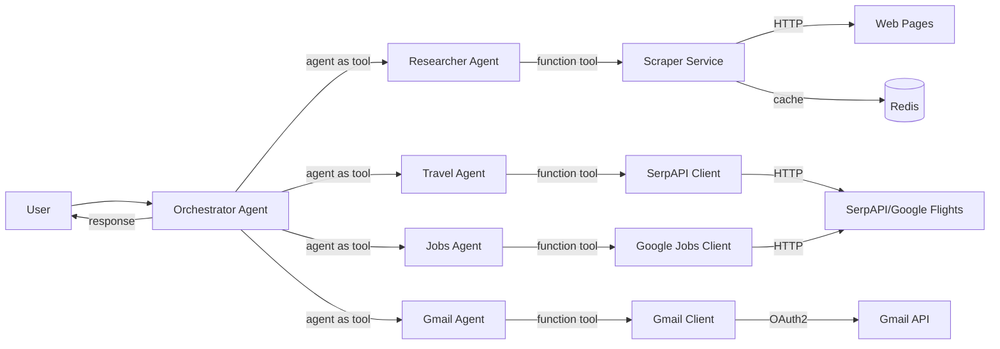
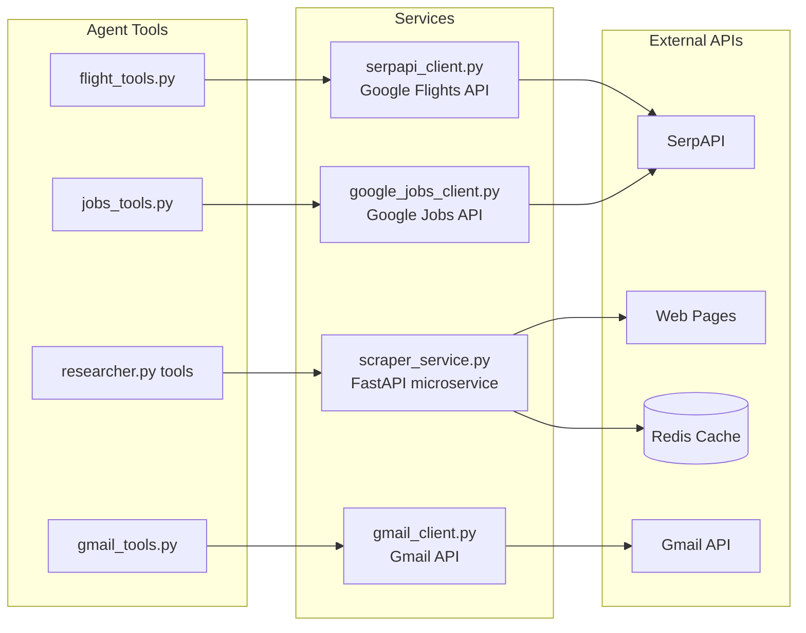

# Architecture

## System Overview

The Personal Assistant uses a multi-agent architecture with specialized agents handling different domains:

## Agent Hierarchy

```mermaid
flowchart TD
    orchestrator[Orchestrator Agent<br/>Main entry point] --> researcher[Researcher Agent<br/>Web scraping & research]
    orchestrator --> travel[Travel Agent<br/>Flight search & travel planning]
    orchestrator --> jobs[Jobs Agent<br/>Job search & career assistance]
    orchestrator --> gmail[Gmail Agent<br/>Inbox organization & labeling]
    
    researcher --> scrape_tool[scrape_url]
    researcher --> research_tool[get_research_summary]
    
    travel --> flight_oneway[search_one_way_flight]
    travel --> flight_roundtrip[search_round_trip_flight]
    travel --> airport_tool[search_airports]
    
    jobs --> search_jobs[search_jobs]
    jobs --> search_jobs_filtered[search_jobs_with_filters]
    jobs --> next_page[get_next_page_jobs]
    
    gmail --> list_labels[list_gmail_labels]
    gmail --> create_label[create_gmail_label]
    gmail --> categorize[categorize_emails_by_sender]
    gmail --> search_emails[search_emails_by_query]
    gmail --> apply_label[apply_label_to_matching_emails]
```

## Service Layer

## Data Flow

1. **User Input** → Orchestrator Agent receives the request
2. **Intent Classification** → Orchestrator determines which specialist agent to invoke
3. **Specialist Processing** → Selected agent uses its tools to gather information
4. **Service Layer** → Tools call appropriate services (Scraper, SerpAPI, etc.)
5. **Response Synthesis** → Specialist agent formats results
6. **Final Response** → Orchestrator presents results to user
